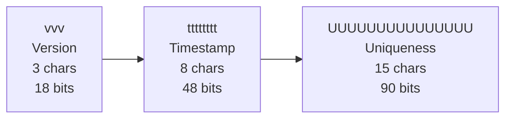

# Introduction

Quid is an unique identifier inspired by [ULID](https://github.com/ulid/spec) and [cuid2](https://github.com/paralleldrive/cuid2)

:::info
**Quid** is designed for human-friendly, versioned, and k-sortable unique IDs, ideal for modern distributed systems.
:::

## 🚀 Features

- <strong>Version-detectable</strong>: The uid can represent the version of item/entity data schema
- <strong>K-Sortable</strong>: The uid can be K-sortable as it is time-based
- <strong>Random-Customizable</strong>: The random specification can be customized, by providing a config
- <strong>Human-Friendly</strong>: Human-friendly writing and reading, as it is represented as <a href="https://base64.guru/standards/base64url">base64url</a>

## 🧬 Quid's Data Structure

Quid IDs are always 26 fixed characters long, encoded in [base64url](https://base64.guru/standards/base64url), and contain version, timestamp, and uniqueness information.

**<u>Structure</u>: `vvvttttttttUUUUUUUUUUUUUUU`** (26 fixed characters, 156 bits)

| Section         | Characters | Bits | Description                                      |
|----------------|-------|------|--------------------------------------------------|
| <strong>vvv</strong>         | 3     | 18   | Version (up to 262,143 versions)                |
| <strong>tttttttt</strong>    | 8     | 48   | Timestamp (up to ~8,919 years)                  |
| <strong>UUUUUUUUUUUUUUU</strong> | 15    | 90   | Uniqueness (up to 1.2e27 unique values)         |

## Quick Links

- [Introduction](./intro.md)
- [Getting Started](./getting-started.md)
- [API Reference](../api)
- [Moonwave](https://eryn.io/moonwave/docs/intro)
